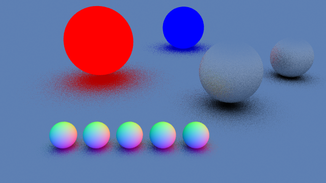

# A simple - yet pretty cool - ray-tracer for CS302 HPC

This is a complete hand-made re-implementation of the C++ [`InOneWeekend`](https://github.com/RayTracing/raytracing.github.io/tree/release/src/InOneWeekend) ray-tracer implementation (an amazing resource!). 

The default rendering produced is 

There are multiple implementations provided: 
- single-threaded
- multi-threaded
- the boilerplate for running the CUDA version is present. However, most of it is missing (as it is your job to implement it in the project)!

It uses [single-file public domain (or MIT licensed) libraries for C/C++](https://github.com/nothings/stb/tree/master).


<div align="center" style="display: flex; align-items: center; justify-content: center; gap: 20px;">
    
    <span style="font-size: 2em;">→</span>
    
</div>
<div align="center">
    <p><em>The CPP renderer that you get, on the left. On the right, the expected result using CUDA</em></p>
</div>


## Using CMAKE to generate compilation scripts

To build your project, start by running

```bash
mkdir build
cd build
cmake .. --fresh -G 'Unix Makefiles' -DCMAKE_EXPORT_COMPILE_COMMANDS=1 && cp compile_commands.json ..
make -j4
```

This should create the required `Makefile` using `CMake` and compile it using 4 threads. You can then execute the CPP version using

```bash
./302_raytracer
```

Rebuilding after changing files is simply (for the CUDA renderer), something like: 

## Running
```bash
make && echo "2" | ./302_raytracer
```

## Develop with VSCode

Install extension `clangd` from `LLVM`, for linting and formatting (the formatting options are present in the `.clangd-format` fil and the options for the linting are in `.clangd`). 

This is all you need ! Please don't install MS `C/C++` plugin, it does not work well with _NVidia_ stuff.

### Running your project during development
- There are *tasks* created in the `.vscode` folder that can be launched with `CTRL+sudoShift+P` → Tasks and then you can build and run. You can even set up key bindings for that.
- Otherwise, run everything from the command line. 

## Choosing RELEASE or DEBUG versions

The first goes fast, the second has debug information. To compile each version, see (README_BUILD.md).

## License

This work is licensed under a [Creative Commons Attribution 4.0 International License](http://creativecommons.org/licenses/by/4.0/).

[](http://creativecommons.org/licenses/by/4.0/) 

**Author:** Pierre-André Mudry